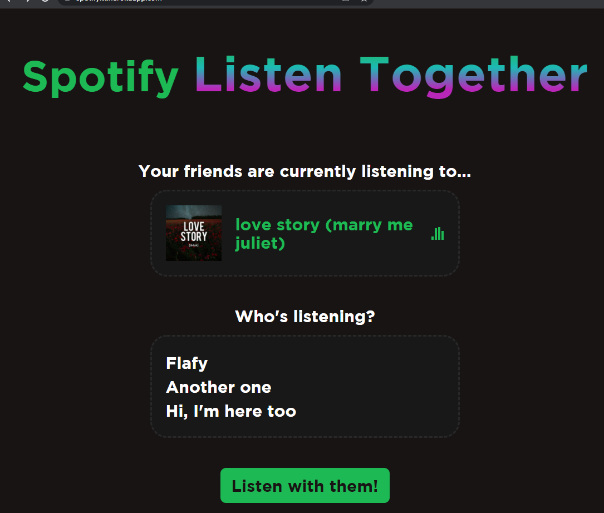

# Spotify Listen Together
### This project is still in development and testing. Please keep this in mind!
Spotify Listen Together is an extension for [Spicetify](https://spicetify.app/) and an alternative solution to Spotify's Group Session.

## Installation
1. Download and install [Spicetify](https://spicetify.app/docs/getting-started/installation).
2. Download the [latest release](https://github.com/FlafyDev/spotify-listen-together/releases/latest) of this extension.
3. Paste `listenTogether.js` in `...\.spicetify\Extensions`(Find the `.spicetify` folder by doing `spicetify -c` in CMD/Powershell)).
4. Run `spicetify config extensions listenTogether.js` and `spicetify apply`.

## Usage
The menu appears after left-clicking on your avatar at the top-right of Spotify's window.

### Creating a Server
To listen together with others, you must first create a server for everyone to join to.
To get started, go to [Spotify Listen Together Server](https://github.com/FlafyDev/spotify-listen-together-server) or host with Heroku.

### Joining a Server
Open the menu and under "Listen Together" there will be a "Connect to server" item. You'll need to enter the server's address and your name.

### Playing, Seeking, and Pausing Songs
After joining a server you might have realized that you can't play anything. Only the hosts are able to change, seek, and pause songs. To gain access to be a host, open the menu and under "Listen Together" there will be a "Request host" item. You'll need to enter the password set by the server.

### Disconnecting From a Server
Open the menu and under "Listen Together" there will be a "Disconnect from server" item.

## Examples
Example of the website:

## TODOs (For both the client and the server)
- Show if a listener is the host/is watching an AD (on the website).
- DONE (not tested) | Wait if a listener is watching an AD.
- DONE (not tested) | Handle listeners who joined while a song was playing.
- Correct the current song's time evey few seconds.
- Ping server every few minutes (In case it's Heroku or something so it won't close).
- DONE (not tested) | Have some sort of visuallizer inside Spotify which shows who's listening with you and if you're connected to a server.
- Change "server" to "room". Have multiple rooms per server.
- Send song requests to the host.
- Notify the host when a song he played has been liked by one of the listeners. 